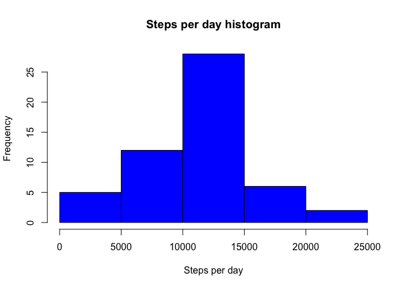
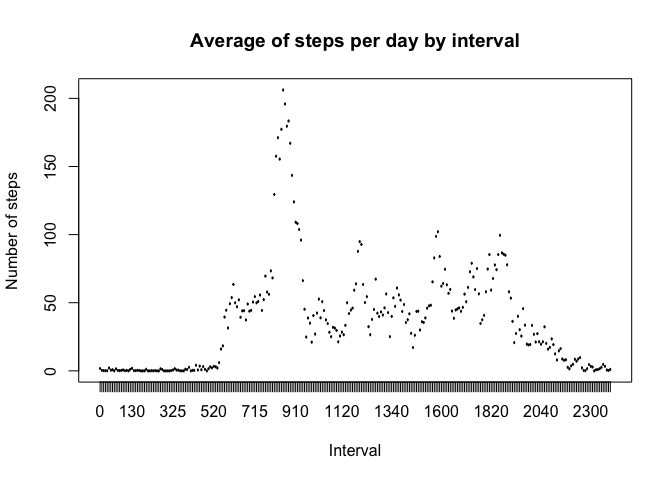
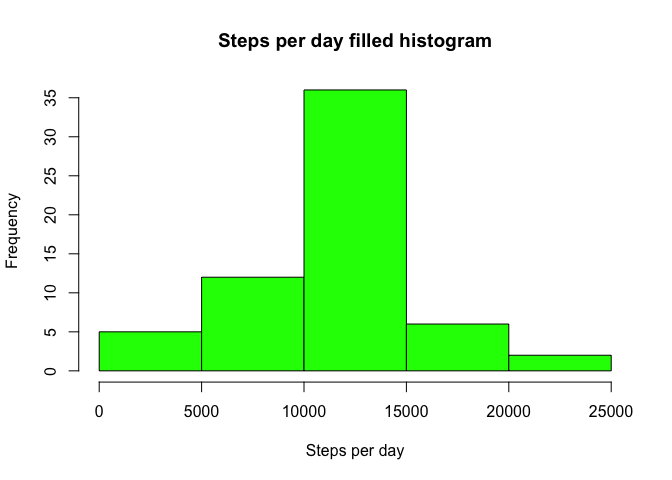
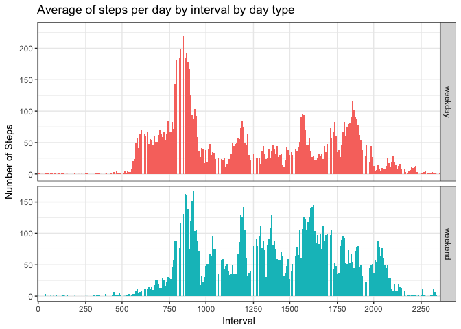

```r
knitr::opts_chunk$set(echo = TRUE, results = 'hold')
```
# Peer-graded Assignment: Course Project 1

## Introduction

It is now possible to collect a large amount of data about personal movement using activity monitoring devices such as a Fitbit, Nike Fuelband, or Jawbone Up. These type of devices are part of the “quantified self” movement – a group of enthusiasts who take measurements about themselves regularly to improve their health, to find patterns in their behavior, or because they are tech geeks. But these data remain under-utilized both because the raw data are hard to obtain and there is a lack of statistical methods and software for processing and interpreting the data.  

## Loading and preprocessing the data

Show any code that is needed to  

1. Load the data  

```r
# Load knitr and set global echo to TRUE
library(knitr)
library(ggplot2)
opts_chunk$set(echo = TRUE)

# Read csv file assuming it is located in the working directory
activity <- read.csv("activity.csv")
```
2. Process/transform the data (if necessary) into a format suitable for your analysis  

Convert the date field into date variables and the interval to factor. 


```r
activity$date = as.Date(activity$date, format("%Y-%m-%d"))
activity$interval = as.factor(activity$interval)
```

## What is mean total number of steps taken per day?  

For this part of the assignment, you can ignore the missing values in the dataset.
1. Calculate the total number of steps taken per day  


```r
stepsXDay = aggregate(steps ~ date, activity, sum, na.action = na.pass)
head(stepsXDay)
```

```
##         date steps
## 1 2012-10-01    NA
## 2 2012-10-02   126
## 3 2012-10-03 11352
## 4 2012-10-04 12116
## 5 2012-10-05 13294
## 6 2012-10-06 15420
```

2. If you do not understand the difference between a histogram and a barplot, research the difference between them. Make a histogram of the total number of steps taken each day  

As we can see, the histogram presents the distribution of the variable step. Each bar's area is proportional to the frequency of the variable step on that interval.  


```r
hist(stepsXDay$steps, main = "Steps per day histogram", xlab = "Steps per day", col = "blue")
```

<!-- -->

3. Calculate and report the mean and median of the total number of steps taken per day  


```r
meanStepsXDay <- mean(stepsXDay$steps, na.rm = TRUE)
str(meanStepsXDay)
medianStepsXDay <-median(stepsXDay$steps, na.rm = TRUE)
str(medianStepsXDay)
```

```
##  num 10766
##  int 10765
```

The mean is 10766.19 and the median is 10765.

## What is the average daily activity pattern?

1. Make a time series plot (i.e. type = "l") of the 5-minute interval (x-axis) and the average number of steps taken, averaged across all days (y-axis)  


```r
intervalSteps <- aggregate(steps ~ interval, activity, mean)
plot(intervalSteps$interval, intervalSteps$steps, type = "l", xlab = "Interval", ylab = "Number of steps", main = "Average of steps per day by interval")
```

<!-- -->

2. Which 5-minute interval, on average across all the days in the dataset, contains the maximum number of steps?  


```r
max_interval <- intervalSteps[which.max(intervalSteps$steps),1]
max_interval <- as.numeric(levels(max_interval))[max_interval]
str(max_interval)
```

```
##  num 835
```

The interval 835 contain the maximum of steps.

## Imputing missing values  

Note that there are a number of days/intervals where there are missing values (coded NA). The presence of missing days may introduce bias into some calculations or summaries of the data.

1. Calculate and report the total number of missing values in the dataset (i.e. the total number of rows with NAs)


```r
na_total <- sum(is.na(activity$steps))
str(na_total)
```

```
##  int 2304
```

The total number of missing values in the dataset is 2304.  

2. Devise a strategy for filling in all of the missing values in the dataset. The strategy does not need to be sophisticated. For example, you could use the mean/median for that day, or the mean for that 5-minute interval, etc.  


```r
na_fill <- function(data, dataReplacement) {
  replacingValue <- function(idx) {
    interval = data[idx,"interval"]
    dataReplacement[dataReplacement$interval == interval,"steps"]
  }
  na_index <- which(is.na(data$steps))
  na_replace <- unlist(lapply(na_index, FUN = replacingValue))
  data[na_index,"steps"] <- na_replace
  data
}
```

We create a method called na_fill that, on input the data that we have to fill and the replacement data, searches for the NA values and it replaces them with the correct value form intervalSteps.  

3. Create a new dataset that is equal to the original dataset but with the missing data filled in.  


```r
activity_filled <- data.frame(  
        steps = na_fill(activity, intervalSteps)$steps,  
        date = activity$date,  
        interval = activity$interval)
str(activity_filled)
```

```
## 'data.frame':	17568 obs. of  3 variables:
##  $ steps   : num  1.717 0.3396 0.1321 0.1509 0.0755 ...
##  $ date    : Date, format: "2012-10-01" "2012-10-01" ...
##  $ interval: Factor w/ 288 levels "0","5","10","15",..: 1 2 3 4 5 6 7 8 9 10 ...
```
The resulting dataset is called activity_filled. We can check how many NA values there is left:  

```r
na_total <- sum(is.na(activity_filled$steps))
str(na_total)
```

```
##  int 0
```


4. Make a histogram of the total number of steps taken each day and Calculate and report the mean and median total number of steps taken per day. Do these values differ from the estimates from the first part of the assignment? What is the impact of imputing missing data on the estimates of the total daily number of steps?  

```r
stepsXDayFilled <- aggregate(steps ~ date, activity_filled, sum)
hist(stepsXDayFilled$steps, main = "Steps per day filled histogram", xlab = "Steps per day", col = "green")
```

<!-- -->

```r
medianFilledStepsXDay <- median(stepsXDayFilled$steps)
str(medianFilledStepsXDay)
meanFilledStepsXDay <- mean(stepsXDayFilled$steps)
str(meanFilledStepsXDay)
```

```
##  num 10766
##  num 10766
```


The mean for the filled data is 10766.19 and the median is 10766.19.  
As we can see, the values differ slightly from the previous part of the assignment.  

Before filling the data:  
Mean : 10766.19  
Median: 10765  

After filling the data:  
Mean : 10766.19  
Median: 10766.19  
We see that the values after filling the data mean and median are equal.  

We observe that while the mean value remains unchanged, the median value has and it equals the mean. Filling the data increases the peak of the distribution, but doesn't affect our predictions.  

## Are there differences in activity patterns between weekdays and weekends?  
For this part the weekdays() function may be of some help here. Use the dataset with the filled-in missing values for this part.  
1. Create a new factor variable in the dataset with two levels – “weekday” and “weekend” indicating whether a given date is a weekday or weekend day.  

```r
activity_filled$dayType <-as.factor(ifelse(weekdays(activity_filled$date, abbreviate = TRUE) != "Sat" & weekdays(activity_filled$date, abbreviate = TRUE) != "Sun", "weekday", "weekend"))
head(activity_filled)
```

```
##       steps       date interval dayType
## 1 1.7169811 2012-10-01        0 weekday
## 2 0.3396226 2012-10-01        5 weekday
## 3 0.1320755 2012-10-01       10 weekday
## 4 0.1509434 2012-10-01       15 weekday
## 5 0.0754717 2012-10-01       20 weekday
## 6 2.0943396 2012-10-01       25 weekday
```
2. Make a panel plot containing a time series plot (i.e. type ="l") of the 5-minute interval (x-axis) and the average number of steps taken, averaged across all weekday days or weekend days (y-axis). See the README file in the GitHub repository to see an example of what this plot should look like using simulated data.  


```r
intervalStepsFilled <- aggregate(steps ~ interval + dayType, activity_filled, mean)
test <- c(0,1,2,3,4,5,6,7,8,9,19)
ggplot(intervalStepsFilled,aes(interval,as.numeric(steps),fill=dayType)) +
  geom_bar(stat="identity") +
  theme_bw() + guides(fill=FALSE)+
  facet_grid(dayType~.,scales = "free",space="free") + 
  labs(x="Interval", y="Number of Steps") + 
  labs(title="Average of steps per day by interval by day type") +
  scale_x_discrete(breaks = seq(0, 2500,250))
```

<!-- -->


